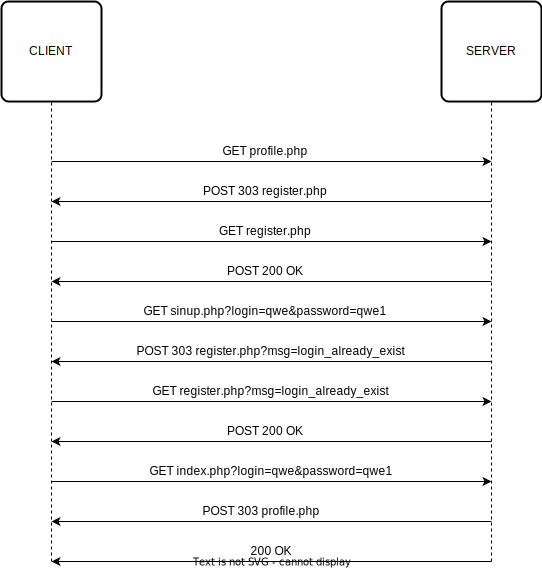

# Отчёт к лабораторной работе №1
## По курсу "Основы программирования"
## Текст задания
Цель работы - спроектировать и разработать систему авторизации пользователей на протоколе HTTP. 
Выполненные требования:
- функциональность входа/выхода, 
- хранение паролей в хешированном виде, 
- форма регистрации, 
- хранение хеша пароля с солью.
## Пользовательский интерфейс
Необходимо создать три страницы: входа, регистрации и главную страницу сайта.
Пользователь, не прошедший авторизацию, не сможет получить доступ к третьей странице.
1. Страница входа

2. Страница регистрации

3. Главная страница сайта

## Пользовательские сценарии работы
1. Пользователь вводит в адресную строку labone/ и попадает на страницу с формой авторизации. При попытки авторизоваться, не заполнив поля, пользователь получить сообщение с ошибкой "Check the fields entered correctly". После чего пользователю будет предложено заново ввести данные для входа.
2. При попытке войти, введя неправильный логин/пароль, пользователь получит сообщение с ошибкой "Wrong login or password!". После чего пользователю будет предложено заново ввести данные для входа.
3. Для создания аккаунта, пользователь нажимает кнопку "register" и переходит на страницу с формой регистрации.
4. При попытке зарегистрироваться, не заполнив одной или несколько полей, пользователь получит сообщение с ошибкой ""Check the fields entered correctly". После чего пользователю будет предложено заново ввести данные для регистрации.
5. Если пользователь введет логин, который уже зарегистрирован (существует в базе данных), то он получит сообщение с ошибкой "This login already exists". После чего пользователю будет предложено заново ввести данные для регистрации.
6. Если пользователь введет разные пароли в поля password и confirm password, то он получит сообщение с ошибкой "Passwords don't match". После чего пользователю будет предложено заново ввести данные для регистрации.
7. При попытке загрузить аватар (картинку) в неправильном формате, пользователь получит сообщение с ошибкой "Error loading the avatar".
8. При удачной регистрации, пользователь получит сообщение "Registration was successful!", после чего его переадресует на страницу авторизации.
9. При удачной авторизации, пользователь попадет на страницу профиля, где он может посмотреть свои данные (имя, почта) и выйти из аккаунта при желании.
10. Авторизованный пользователь вводит в адресной строке register.php или index.php - алгоритм перенаправляет его обратно на profile.php.

## Описание API сервера и  его хореографии
Сервер использует HTTP POST запросы с полями full_name (ФИО), login (логин), email(адрес жлектронной почты), password (пароль), avatar(аватарка). Также, сервер использует ceccию для хранения и передачи данных о пользователе и ошибках между страницами.
1. Алгоритм регистрации на сайте - отправляется запрос, который возвращает данные о пользователе с отправленным логином, если данные найдены, то в сессию записывается сообщение об ошибке, после чего пользователь перенаправляется на register.php, где на экране выведено сообщение "Такой логин уже есть".
2. Алгоритм регистрации на сайте проверяет введенный пароль. Если его длина меньше 4х или больше 12ти символов, то в сессию записывается сообщение об ошибке, после чего пользователь перенаправляется на register.php, где на экране выведено сообщение "Пароль должен быть от 4 до 12 символов".
3. Алгоритм регистрации на сайте сверяет введенные пароли. Если они не совпадают, то в сессию записывается сообщение об ошибке, после чего пользователь перенаправляется на register.php, где на экране выведено сообщение "Пароли не совпадают".
4. Алгоритм регистрации на сайте проверяет результат выполнения функции move_uploaded_file(). Если функцию выполнить по какой-то причине не удалось, то в сессию записывается сообщение об ошибке, после чего пользователь перенаправляется на register.php, где на экране выведено сообщение "Ошибка при загрузке сообщения".
5. Алгоритм аутентификации сверяет введеные пароль и логин с имеющимися в базе данных. Если пользователь с такими логином и паролем не был найден, то в сессию записывается сообщение об ошибке, после чего пользователь перенаправляется на index.php, где на экране выведено сообщение "Неверный логин или пароль".
6. Алгоритм аутентификации сверяет введеные пароль и логин с имеющимися в базе данных. Если пользователь с такими логином и паролем был найден, то массив с данными пользователя с помощью функции mysqli_fetch_assoc(). Из этого массива в сессию записываются поля 'id', 'full_name', 'avatar' и 'email'. После чего пользователя направляют на страницу profile.php. После того как пользователь выйдет, запускается функция деаутентификации пользователя, которая удаляет данные пользователя из сессии.
7. Если пользователь не вошел в свою учетную запись, но ввел в адресной строке profile.php, то алгоритм проверяет данные польщователя, хранящиеся в сессии, после чего перенаправляет его обратно на index.php.
8. Если пользователь не вышел из своей учетной записи, но ввел в адресной строке register.php или index.php, то алгоритм проверяет наличие данных пользователя в сессии и перенаправляет его обратно на profile.php.

## Описание структуры базы данных
Для администрирования сервера MySQL и просмотра содержимого базы данных используется браузерное приложение phpMyAdmin. Используется 6 столбцов:
1. "id" типа int с автоматическим приращением для выдачи уникальных id каждому зарегистрированному пользователю,
2. "Full_name" типа varchar для хранения ФИО пользователя,
3. "login" типа varchar для хранения логина этого пользователя, используется в качетсве соли для хеширования пароля,
4. "email"  типа varchar для хранения адреса электронной почты пользователя,
5. "password" типа varchar для хранения пароля пользователя в хешированном виде,
6. "avatar" типа varchar для хранения аватарки пользователя.

Пример данных, введенных пользователем:

## Описание алгоритмов
1. Алгоритм авторизации

2. Алгоритм регистрации

## Пример HTTP запросов/ответов

## Значимые фрагменты кода
1. Алгоритм авторизации
```
<?php

session_start();
require_once( 'connect.php' );

$login = $_POST[ 'login' ];
$password = $_POST[ 'password' ];

$error_fields = [];

if ( $login === '' ) {
  $error_fields[] = 'login';
}

if ( $password === '' ) {
  $error_fields[] = 'password';
}

if ( !empty( $error_fields ) ) {
  $response = [
    "status" => false,
    "type" => 1,
    "message" => "Check the fields entered correctly",
    "fields" => $error_fields
  ];

  echo json_encode( $response );

  die();
}

$password = md5( $_POST[ 'password' ] . $_POST[ 'login' ] );

$check_user = mysqli_query( $connect, "SELECT * FROM `users` WHERE `login` = '$login' AND `password` = '$password'" );
if ( mysqli_num_rows( $check_user ) > 0 ) {

  $user = mysqli_fetch_assoc( $check_user );

  $_SESSION[ 'user' ] = [
    "id" => $user[ 'id' ],
    "name" => $user[ 'name' ],
    "avatar" => $user[ 'avatar' ],
    "email" => $user[ 'email' ]
  ];

  $response = [
    "status" => true
  ];

  echo json_encode( $response );

} else {

  $response = [
    "status" => false,
    "message" => 'Wrong login or password!'
  ];

  echo json_encode( $response );
}
?>
```
2. Алгоритм регистрации
```
<?php

session_start();
require_once 'connect.php';

$name = $_POST['name'];
$login = $_POST['login'];
$email = $_POST['email'];
$password = $_POST['password'];
$password_confirm = $_POST['password_confirm'];

$check_login = mysqli_query($connect, "SELECT * FROM `users` WHERE `login` = '$login'");
if (mysqli_num_rows($check_login) > 0) {
    $response = [
        "status" => false,
        "type" => 1,
        "message" => "This login already exists",
        "fields" => ['login']
    ];

    echo json_encode($response);
    die();
}

$error_fields = [];

if ($login === '') {
    $error_fields[] = 'login';
}

if ($password === '') {
    $error_fields[] = 'password';
}

if ($name === '') {
    $error_fields[] = 'name';
}

if ($email === '' || !filter_var($email, FILTER_VALIDATE_EMAIL)) {
    $error_fields[] = 'email';
}

if ($password_confirm === '') {
    $error_fields[] = 'password_confirm';
}

if (!$_FILES['avatar']) {
    $error_fields[] = 'avatar';
}

if (!empty($error_fields)) {
    $response = [
        "status" => false,
        "type" => 1,
        "message" => "Check the fields entered correctly",
        "fields" => $error_fields
    ];

    echo json_encode($response);

    die();
}

if ($password === $password_confirm) {

    $path = 'uploads/' . time() . $_FILES['avatar']['name'];
    if (!move_uploaded_file($_FILES['avatar']['tmp_name'], '../' . $path)) {
        $response = [
            "status" => false,
            "type" => 2,
            "message" => "Error loading the avatar",
        ];
        echo json_encode($response);
    }

    $password = md5($password);

    mysqli_query($connect, "INSERT INTO `users` (`id`, `name`, `login`, `email`, `password`, `avatar`) VALUES (NULL, '$name', '$login', '$email', '$password', '$path')");

    $response = [
        "status" => true,
        "message" => "Registration was successful!",
    ];
    echo json_encode($response);


} else {
    $response = [
        "status" => false,
        "message" => "Passwords don't match",
    ];
    echo json_encode($response);
}

?>
```
